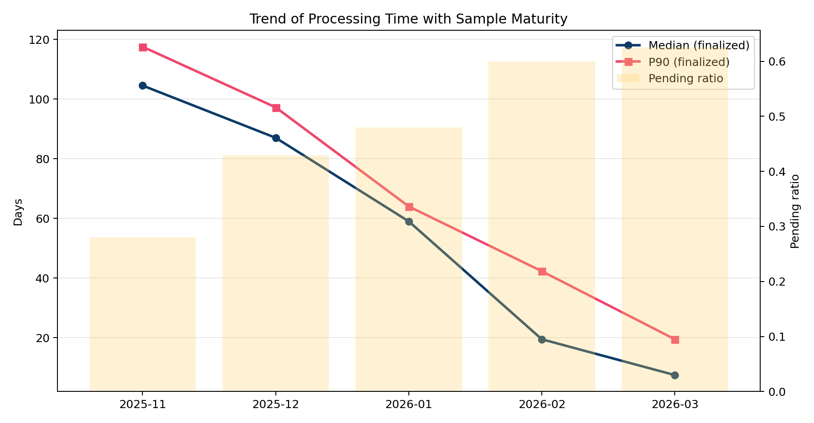
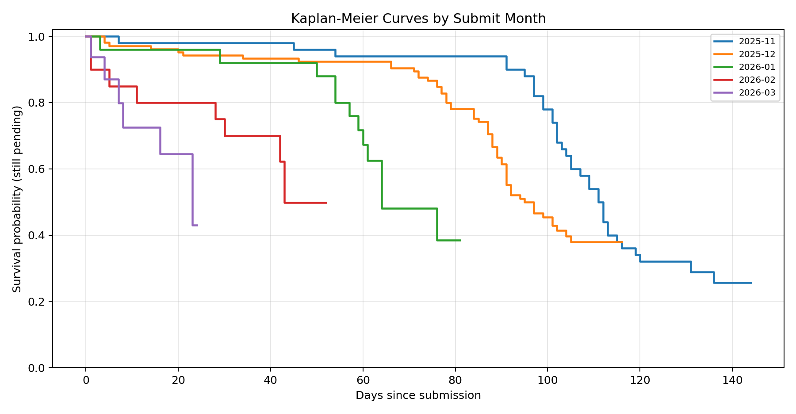
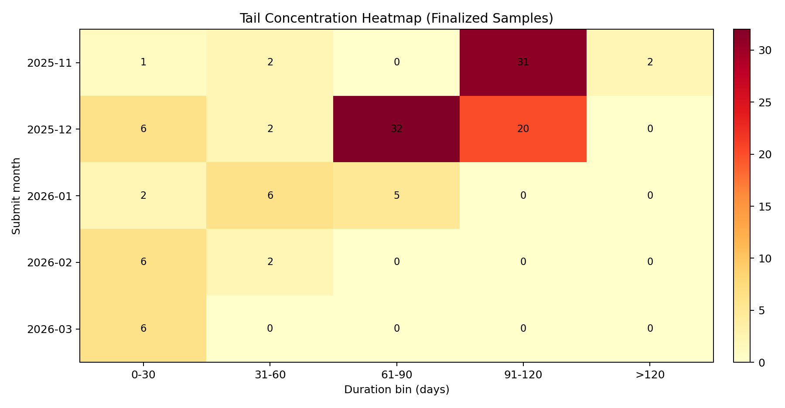
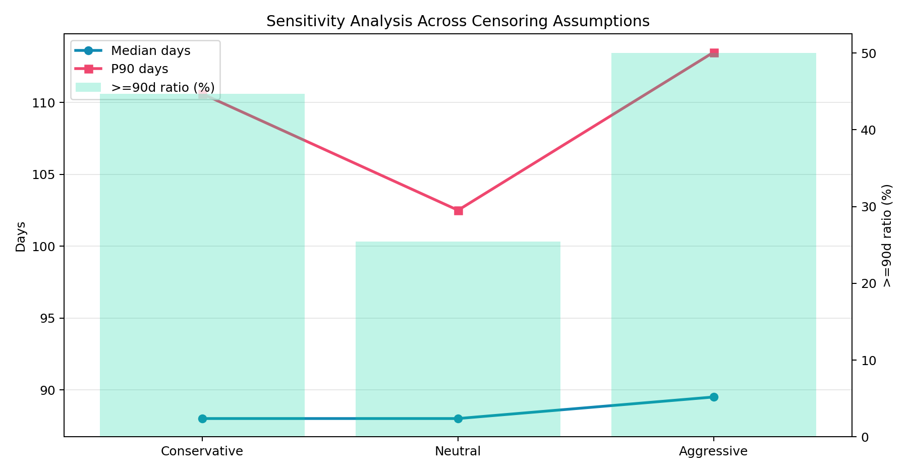

# F1 Check 学术分析报告（2025-11 至 2026-03）

## 1. 执行摘要
- 样本：去重后 216 条，其中结案样本 123 条，右删失样本 93 条。
- 主口径（结案样本）中位数 88.00 天（Bootstrap 95% CI: 78.00-91.00），P90 110.60 天（95% CI: 103.80-113.00）。
- 长尾（>=90 天）占比 44.72%；样本成熟度 56.94%。
- 趋势回归：中位数月度斜率 -26.15 天/月（R²=0.976），P90 月度斜率 -25.09 天/月（R²=0.994）。
- 早期（11-12月）与后期（1-3月）中位差检验：|ΔMedian|=61.00 天，置换检验 p=0.0001。

## 2. 研究问题与识别策略
- 问题一：处理时长是否发生结构性变化。
- 问题二：长尾风险（>=90 天）是否显著缓解。
- 问题三：Pending 未回填偏差如何影响结论。
- 识别框架：将 Clear/Reject 视为事件发生，Pending 视为右删失样本，用 Kaplan-Meier 和敏感性区间联合识别。

## 3. 数据质量与预处理
- 原始分段记录数：217
- 解析成功率：100.00%
- 去重后记录数：216（去重剔除 1 条）
- 右删失定义：截至观察日 2026-03-27，仍未更新完成日期的样本记为 censored。
- 风险提示：Pending 同时包含真实未结案与已结案未回填。

## 4. 描述性统计
- 结案样本均值 74.98，中位数 88.00，IQR 41.00，标准差 34.31。
- 结案样本 P90 110.60，最大值 136。
- 右删失样本已观察中位数 99.00，P90 123.00。

## 5. 生存分析（Kaplan-Meier）
- Kaplan-Meier 曲线按提交月份分层绘制，生存概率表示“截至 t 天仍未结案”的比例。
- 生存曲线数据已导出到 f1_check_km_curve_points.csv，便于后续复核或二次建模。
- 结果解读：早期月份曲线下降更慢且尾部更长，后期月份下降更快。

## 6. 趋势检验与显著性
- 中位数趋势斜率：-26.15 天/月，P90 趋势斜率：-25.09 天/月。
- 11-12 月 vs 1-3 月置换检验：p=0.0001。
- 五个月 Kruskal-Wallis（置换）检验：H=72.763, p=0.0001。
- 统计意义：趋势变化不是单月随机波动，更接近结构性变化。

## 7. 右删失敏感性分析
| 口径 | 中位数(天) | P90(天) | >=90天占比 |
|---|---:|---:|---:|
| Conservative | 88.00 | 110.60 | 44.72% |
| Neutral | 88.00 | 102.50 | 25.46% |
| Aggressive | 89.50 | 113.50 | 50.00% |
- Conservative 仅使用结案样本；Neutral 对删失样本按中位数回填；Aggressive 使用已观察时长。
- 三口径共同给出识别区间，可避免单一假设导致的过度确定性。

## 8. 停摆长尾假说的证据
- 早期批次（2025-11/12）在高分位和长尾密度上显著高于后期批次。
- 热力图显示 91-120 天与 >120 天区间的密度主要集中在早期月份。
- 该证据支持“历史行政冲击+积压”假说，但受未回填行为影响，幅度估计仍需滚动更新。

## 9. 图表
### 9.1 趋势与成熟度联合图

### 9.2 Kaplan-Meier 分月曲线

### 9.3 长尾热力图

### 9.4 敏感性区间图

## 10. 局限与后续工作
- 未回填状态导致删失机制可能非随机，这会影响高分位推断。
- 样本来自自报平台，存在选择偏差与信息截断。
- 后续建议：每周滚动更新并追加同口径再估计；若获得官方导出字段，可做更严格分层回归。