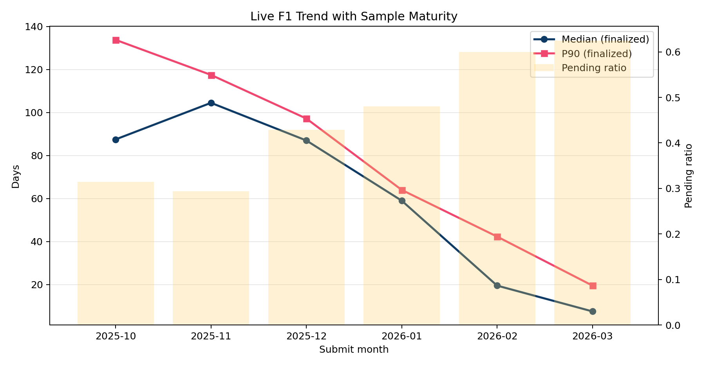
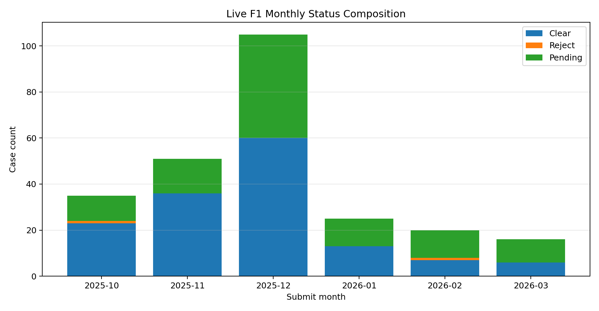
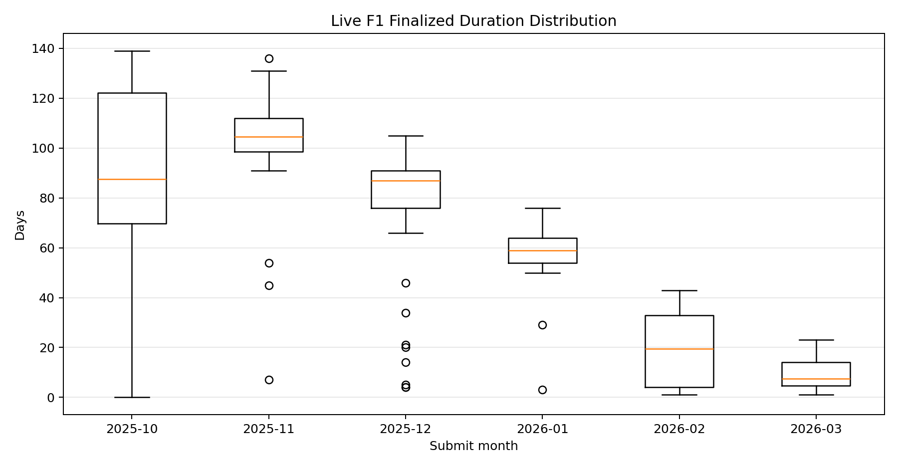

# F1 Check 实时自动分析报告（Live）

## 1. 数据来源与抓取说明
- 来源站点：checkee.info 公共页面。
- 抓取时间：2026-03-27 20:57:38
- 观察日：2026-03-27
- 抓取月份范围：2025-10 至 2026-03（共 6 个月）
- 抓取对象：仅保留 Visa Type = F1 的明细行。

## 2. 样本概览
- F1 样本总量（去重后）：252
- 结案样本（Clear/Reject）：147
- 右删失样本（Pending）：105
- 样本成熟度（结案占比）：58.33%

## 3. 主结果（结案样本口径）
- 中位数：88.00 天（Bootstrap 95% CI: 80.00-91.00）
- P90：114.40 天（Bootstrap 95% CI: 111.00-120.40）
- 均值：76.59 天，IQR：42.00，标准差：36.89
- 长尾（>=90天）占比：44.90%

## 4. 右删失诊断
- Pending 已观察时长中位数：101.00 天
- Pending 已观察时长 P90：146.40 天
- 解释：Pending 同时含“真实未结案”和“已结案未回填”，因此报告保留区间估计。

## 5. 趋势分析
- 月度中位数斜率：-19.51 天/月（R²=0.848）
- 月度P90斜率：-23.72 天/月（R²=0.992）
- 说明：负斜率表示最近月份处理时长在缩短，但需结合 pending_ratio 一起解读。

## 6. 敏感性分析（Pending 假设）
| Scenario | Median (days) | P90 (days) | >=90d ratio |
|---|---:|---:|---:|
| Conservative | 88.00 | 114.40 | 44.90% |
| Neutral | 88.00 | 108.80 | 26.19% |
| Aggressive | 91.00 | 127.00 | 51.98% |

## 7. 月度明细
| Month | Total | Clear | Reject | Pending | Pending% | Median | P90 | >=90d% |
|---|---:|---:|---:|---:|---:|---:|---:|---:|
| 2025-10 | 35 | 23 | 1 | 11 | 31.43% | 87.5 | 133.8 | 45.83% |
| 2025-11 | 51 | 36 | 0 | 15 | 29.41% | 104.5 | 117.5 | 91.67% |
| 2025-12 | 105 | 60 | 0 | 45 | 42.86% | 87.0 | 97.2 | 36.67% |
| 2026-01 | 25 | 13 | 0 | 12 | 48.00% | 59 | 64.0 | 0.00% |
| 2026-02 | 20 | 7 | 1 | 12 | 60.00% | 19.5 | 42.3 | 0.00% |
| 2026-03 | 16 | 6 | 0 | 10 | 62.50% | 7.5 | 19.5 | 0.00% |

## 8. 图表

## 9. 自动化运行
- 每次运行本脚本会实时抓取 checkee 最新公开页面并重建报告。
- 若站点策略变化导致403，可尝试更换网络或稍后重试。