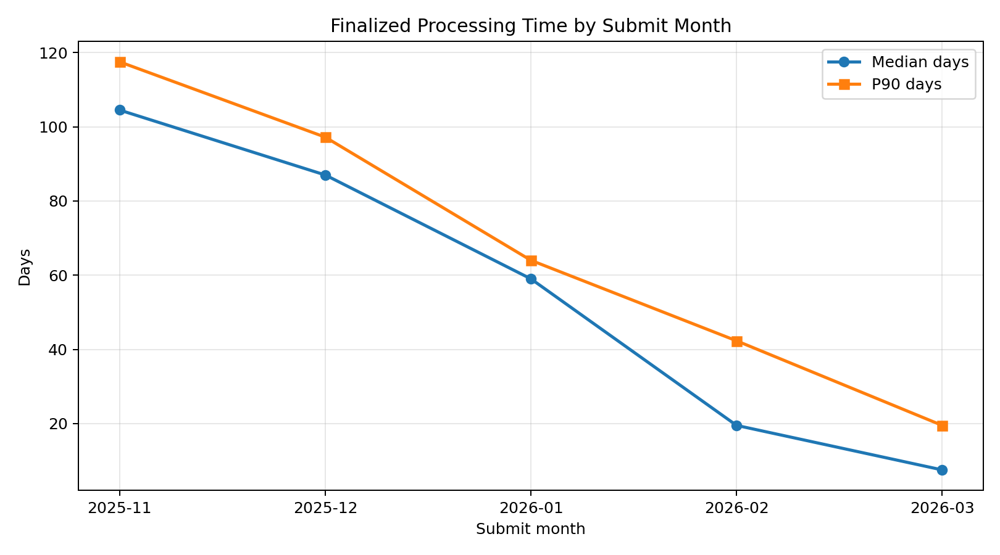
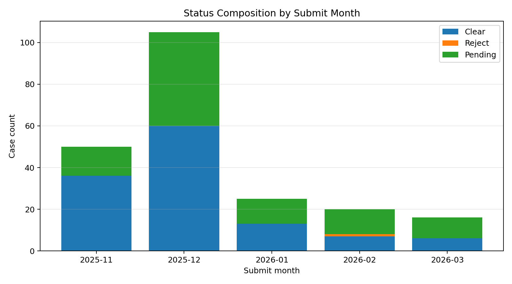
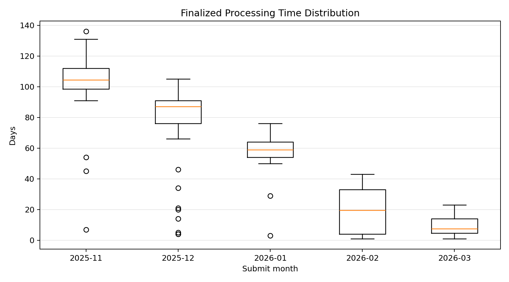

# F1 Check 处理时间分析报告（2025-11 至 2026-03）

## 1. 执行摘要
- 样本规模：去重后 216 条；结案样本 123 条；Pending 93 条。
- 主口径处理时长：中位数 88.0 天，P90 110.6 天，最大值 136 天。
- 长尾风险：>=90 天占比 44.72%（55/123）。
- 停摆长尾对比：11-12 月 P90=112.0 天，1-3 月 P90=64.0 天，变化 -48.0 天。
- 结论：早期提交批次长尾显著，后期已结案样本处理时长明显缩短；但近月 Pending 占比高，需结合成熟度解读。

## 2. 数据清洗质量
- 原始分段记录数：217
- 解析成功记录数：217
- 解析失败记录数：0
- 解析成功率：100.00%
- 去重后记录数：216
- 去重剔除记录数：1
- 状态分布：Clear=122, Reject=1, Pending=93
- 数据成熟度（Clear+Reject 占比）：56.94%
- reported_days 与日期差不一致条数：0

主要解析问题（Top 5）：
- ok: 217

## 3. 处理时间核心统计（天）
- 主口径（仅 Clear/Reject）样本数：123
- 均值：74.98，中位数：88.00，P90：110.60，最大值：136
- 长尾（>=90天）占比：44.72%（55/123）
- Pending 已观察时长（截至 2026-03-27）：中位数 99.00，P90 123.00

三口径区间（处理中样本不确定性）：
- 保守口径（Pending 全未结案）中位数：88.00，P90：110.60
- 中性口径（Pending 以主口径中位数回填）中位数：88.00，P90：102.50
- 激进口径（Pending 以已观察时长计入）中位数：89.50，P90：113.50

## 4. 月度趋势明细（提交月份）
| 月份 | 总样本 | Clear | Reject | Pending | Pending占比 | 结案中位数 | 结案P90 | >=90天占比 |
|---|---:|---:|---:|---:|---:|---:|---:|---:|
| 2025-11 | 50 | 36 | 0 | 14 | 28.00% | 104.5 | 117.5 | 91.67% |
| 2025-12 | 105 | 60 | 0 | 45 | 42.86% | 87.0 | 97.2 | 36.67% |
| 2026-01 | 25 | 13 | 0 | 12 | 48.00% | 59 | 64.0 | 0.00% |
| 2026-02 | 20 | 7 | 1 | 12 | 60.00% | 19.5 | 42.3 | 0.00% |
| 2026-03 | 16 | 6 | 0 | 10 | 62.50% | 7.5 | 19.5 | 0.00% |

- 11-12月结案样本 P90：112.00 天
- 1-3月结案样本 P90：64.00 天
- P90 变化：-48.00 天（用于评估停摆长尾是否缓解/加剧）
- 解读：2025-11 的长尾占比极高（>90%），而 2026-01 之后结案样本几乎不再出现 >=90 天长尾。

## 5. 图表
### 5.1 结案处理时长趋势

- 用途：看处理时长的中心趋势和高分位风险是否同步下降。

### 5.2 月度状态结构

- 用途：看每个月 Pending 占比，判断样本成熟度和未回填风险。

### 5.3 结案分布箱线图

- 用途：看离散度和异常长尾，避免只看均值。

## 6. 关于‘有人不更新状态’的偏差说明
- Pending 同时包含真实在审和已结案未回填，不能直接当作真实在审规模。
- 因此主结论使用‘仅结案样本’，并辅以三口径区间反映不确定性。
- 最近月份 pending_ratio 更高，可能造成‘看起来处理变慢/变快’的统计错觉。
- 实操建议：月度趋势展示时并排给出 pending_ratio，并把最近1个月标注为低成熟度区。

## 7. 给你可直接引用的结论话术
- 从已结案样本看，2025-11~12 的处理时间明显更长，存在显著长尾；2026-01 之后中位数和P90都显著下降。
- 但 2026-02~03 的 Pending 占比高，当前趋势应理解为‘已结案样本变快’，不是‘全部样本都变快’。
- 若考虑未回填，整体中位处理时间大致落在 88~89.5 天区间，高分位风险（P90）约在 102.5~113.5 天区间。